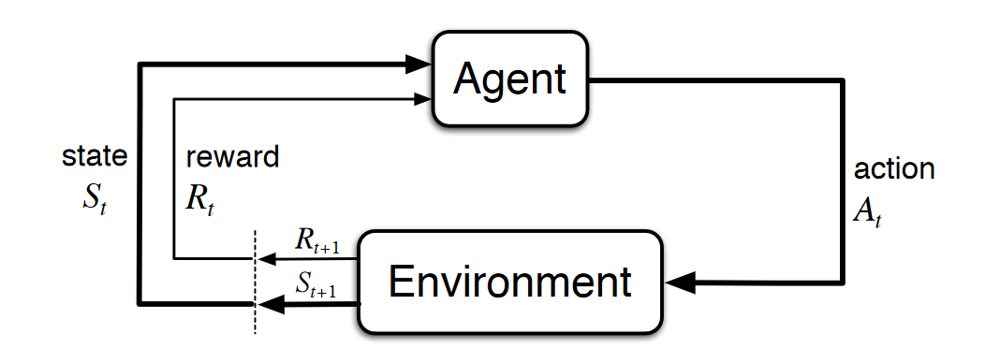

# Oats or Die
A reinforcement learning game that involves unicorns, magic oats, and death. 

## Reinforcement learning
*Intelligence is the measure of an agent’s ability to achieve goals in a wide range of environments.
–Jürgen Schmidhuber*

Reinforcement learning (RL) is a machine learning technique that attempts to learn a strategy, called a policy, that optimizes an objective for an **agent** acting in an **environment**. For example, the agent might be a robot, the environment might be a maze, and the goal might be to successfully navigate the maze in the smallest amount of time. 

In RL, the agent takes an **action**, observes the state of the environment, and gets a **reward** based on the value of the current **state** of the environment. The goal is to maximize the long-term reward that the agent receives as a result of its actions. RL is well-suited for solving problems where an agent can make autonomous decisions. 

## Terminology
### Markov Decision Process

&nbsp;&nbsp;&nbsp;&nbsp;&nbsp;&nbsp;

* **Agent** - Acts for a user or other program in a relationship of agency, which derives from the Latin agere (to do): an agreement to act on one's behalf. Such "action on behalf of" implies the authority to decide which, if any, action is appropriate.
* **Environment** - Defines the space in which the RL model operates. This can be either a real-world environment or a simulator. For example, if you train a physical autonomous vehicle on a physical road, that would be a real-world environment. If you train a computer program that models an autonomous vehicle driving on a road, that would be a simulator
* **State** ( S ) - Specifies all information about the environment and past steps that is relevant to the future. For example, in an RL model in which a robot can move in any direction at any time step, then the position of the robot at the current time step is the state, because if we know where the robot is, it isn't necessary to know the steps it took to get there. 
* **Action** ( A ) - What the agent does. For example, the robot takes a step forward.
* **Probability** ( P ) is a probability matrix that tells the probability of moving from one state to the other.
* **Reward** ( R ) - A number that represents the value of the state that resulted from the last action that the agent took. For example, if the goal is for a robot to find treasure, the reward for finding treasure might be 5, and the reward for not finding treasure might be 0. The RL model attempts to find a strategy that optimizes the cumulative reward over the long term. This strategy is called a **policy**. 
* **Discount Factor** ( \gamma )

### Developmement Concepts
* Episodes - An episode consists of all of the time steps in an MDP from the initial state until the environment reaches the terminal state. 
* Policy ( \pi )
* Value Function
* Q-Learning (q)
* Deep Q-Learning
* Learning Rate ( \alpha )
* Exploitation v. Exploration

### Narrative
Unicorns love magic oats

Voldemort loves unicorns, to eat (drink their blood specifically).

### Objective
Get the maximum amount of oats, avoid Voldemort

### Range of motion

### Grid Scoring

## Resources
* [Use Reinforcement Learning with Amazon SageMaker](https://docs.aws.amazon.com/sagemaker/latest/dg/reinforcement-learning.html)
* [Managed Reinforcement Learning with Amazon SageMaker](https://aws.amazon.com/blogs/aws/amazon-sagemaker-rl-managed-reinforcement-learning-with-amazon-sagemaker/)
* [Automating financial decision making with deep reinforcement learning](https://aws.amazon.com/blogs/machine-learning/automated-decision-making-with-deep-reinforcement-learning/)
* [Custom deep reinforcement learning and multi-track training for AWS DeepRacer with Amazon SageMaker RL Notebook](https://aws.amazon.com/blogs/machine-learning/custom-deep-reinforcement-learning-and-multi-track-training-for-aws-deepracer-with-amazon-sagemaker-rl-notebook/)
* [An introduction to reinforcement learning with AWS RoboMaker](https://aws.amazon.com/blogs/machine-learning/an-introduction-to-reinforcement-learning-with-aws-robomaker/)
* [Amazon SageMaker RL – Managed Reinforcement Learning with Amazon SageMaker](https://aws.amazon.com/blogs/aws/amazon-sagemaker-rl-managed-reinforcement-learning-with-amazon-sagemaker/)
* [Training batch reinforcement learning policies with Amazon SageMaker RL](https://aws.amazon.com/blogs/machine-learning/training-batch-reinforcement-learning-policies-with-amazon-sagemaker-rl/)
* [Building an AI-powered Battlesnake with reinforcement learning on Amazon SageMaker](https://aws.amazon.com/blogs/machine-learning/building-an-ai-powered-battlesnake-with-reinforcement-learning-on-amazon-sagemaker/)
* [AWS DeepRacer: Driven by Reinforcement Learning](https://www.aws.training/Details/eLearning?id=32143)
* [Reinforcement Learning with AWS DeepRacer](https://towardsdatascience.com/reinforcement-learning-with-aws-deepracer-99b5dd2557c8)